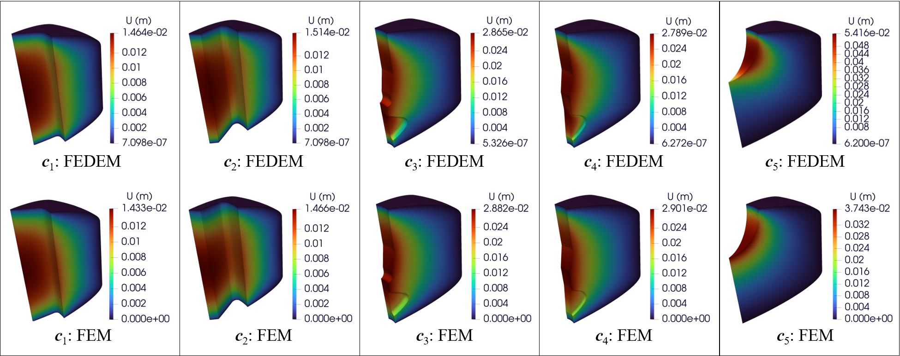
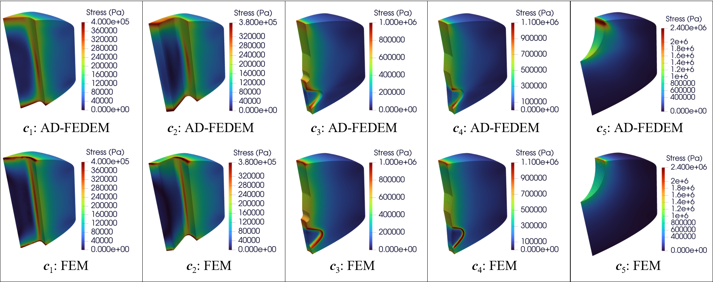

# AD-FEDEM - Auto-Decoding Finite Element-Enhanced Deep Energy Method

To bridge this gap between deep learning and industrial-scale engineering simulations, we propose the AD-FEDEM for simulating and analyzing hyperelastic problems in solid propellants. This novel framework integrates the geometric flexibility of unstructured FEM meshes with the computational efficiency of deep learning.

*Fig 1: displacement of batched grains simulation results*

*Fig 2: stress of batched grains simulation results*

## Project Structure

The project consists of the following main modules:

- **DEM3D**: vanilla deep energy method for hyperelastic 3D beam bending, according to paper _A deep energy method for finite deformation hyperelasticity_
- **Beam3D**: hyperelastic 3D beam benchmark to examine AD-FEDEM's advantage over DEM proposed in previous works
- **Grain3D**: single complex grain experiment to demonstrate AD-FEDEM's capacity for intricate geometry
- **Grain3D_DataDriven**: ablation study on the loss function to verify the effectiveness of the data-driven design
- **GroupGrains**: batched grains experiment to demonstrate AD-FEDEM's ability of solving multiple propellants in parallel

## Technical Features

- adaptive unstructured meshes to improve local solution accuracy
- Gaussian quadrature for precise numerical integration
- a data-driven framework that combines physics with real-world data
- latent vectors to encode geometric features of different grains

## Usage

1. Configure the `Config.py` file of the corresponding module to set the required parameters
2. Run `Train.py` for model training
3. Use `Evaluate.py` to evaluate results
4. Use ParaView software to visualiza results

## System Requirements

- python 3.11.10
- pyTorch 2.4.1
- numPy
- sciPy
- matplotlib (for visualization)
- meshio
